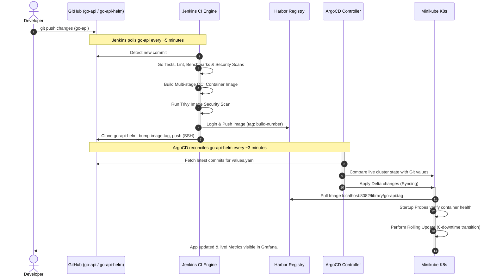

# Local CI/CD GitOps Learning Platform

This project is a complete, self-contained local CI/CD and GitOps learning sandbox. It shows how a modern Kubernetes-native application is built, scanned, versioned, and delivered end-to-end using industry-standard tools: **Go/Gin**, **Docker**, **Harbor**, **Jenkins**, **Helm**, **ArgoCD**, **Kubernetes (Minikube)**, and **Prometheus/Grafana** — triggered by a real commit to a real GitHub account.

---

## Architecture Diagrams

### 1. Overall System Architecture
```mermaid
graph TD
    subgraph Developer Workspace
        Dev[Developer] -->|git push| GitHub[GitHub: go-api]
    end

    subgraph CI Engine
        Jenkins[Jenkins Pipeline Runner]
        GitHub -->|SCM Poll every ~5 min| Jenkins
    end

    subgraph Security & Verification
        Jenkins -->|Lint & Test| GoTest[Go Vet / golangci-lint / Unit Tests]
        Jenkins -->|Security Scans| Gosec[Gosec / govulncheck / Gitleaks]
        Jenkins -->|Build & Scan Image| Trivy[Trivy Vulnerability Scan]
    end

    subgraph Image Registry
        Harbor[Harbor Registry :8082]
        Trivy -->|Push Checked Image| Harbor
    end

    subgraph GitOps Infrastructure
        GitHubHelm[GitHub: go-api-helm]
        ArgoCD[ArgoCD Controller]
        Jenkins -->|Push image.tag bump over SSH| GitHubHelm
        GitHubHelm -->|Read Helm Manifests| ArgoCD
    end

    subgraph Kubernetes Cluster (Minikube)
        ArgoCD -->|Sync State| K8s[Minikube Cluster]
        K8s -->|Pull Image| Harbor
        K8s -->|Rolling Update Live| Pods[Go REST API Pods]
        Pods -->|/metrics| Prometheus[Prometheus]
        Prometheus --> Grafana[Grafana Dashboards]
    end
```

### 2. Sequence Workflow Diagram


---

## Repositories

This platform spans **three separate GitHub repositories**, matching how real GitOps setups separate app CI from cluster state:

| Repo | Purpose |
|---|---|
| [`go-api`](https://github.com/SakthiSP333/go-api) | The Gin REST API source, Dockerfile, and Jenkinsfile. Jenkins polls this repo. |
| [`go-api-helm`](https://github.com/SakthiSP333/go-api-helm) | The Helm chart and ArgoCD `Application`/`ApplicationSet` manifests. Jenkins pushes image-tag bumps here; ArgoCD watches it. |
| `local-cicd-platform` (this repo) | Bootstrap scripts, root `Makefile`, and infra install scripts that stand up Minikube/Harbor/Jenkins/ArgoCD/Prometheus on your machine. |

### Directory Structure
```text
local-cicd-platform/          (this repo)
├── Makefile                          # Root command orchestrator
├── README.md                         # This user manual
├── go-api/                           # <- git clone here (separate repo, gitignored)
├── go-api-helm/                       # <- git clone here (separate repo, gitignored)
├── infrastructure/
│   └── jenkins/Dockerfile            # Custom Jenkins image (git, docker CLI, yq, security tools)
└── scripts/                          # Platform Bootstrappers (Idempotent)
    ├── bootstrap.sh                  # Complete platform installer
    ├── cleanup.sh                    # Full infrastructure teardown
    ├── install-tools.sh              # CLI tools installer (kubectl, helm, trivy, etc.)
    ├── install-harbor.sh             # Harbor installer
    ├── create-harbor-project.sh      # Harbor API automation
    ├── install-jenkins.sh            # Builds/runs Jenkins, provisions credentials + seed job headlessly
    ├── install-argocd.sh             # Deploys ArgoCD in Minikube, registers the go-api Application
    └── install-monitoring.sh         # Installs kube-prometheus-stack (Prometheus + Grafana)
```

`go-api/` holds its own `scripts/update-chart.sh` (the Helm version-bump helper Jenkins runs) since Jenkins only ever checks that repo out directly.

---

## Local Setup Prerequisites

1. **Docker Engine / Desktop** (v20.10+)
2. **Git**, plus an SSH key registered with your personal GitHub account (used by Jenkins/ArgoCD to reach `go-api`/`go-api-helm`)
3. **Go** (v1.21+) - optional, but recommended for running local tests

---

## Installation by OS Distribution

### Ubuntu / Debian
```bash
sudo apt-get update && sudo apt-get install -y curl git
sudo apt-get install -y docker.io docker-compose-v2
sudo systemctl enable --now docker
sudo usermod -aG docker $USER && newgrp docker
```

### Fedora / RedHat
```bash
sudo dnf install -y git curl
sudo dnf install -y moby-engine docker-compose-plugin
sudo systemctl enable --now docker
sudo usermod -aG docker $USER && newgrp docker
```

### Arch Linux
```bash
sudo pacman -Syu --noconfirm git curl docker docker-compose
sudo systemctl enable --now docker
sudo usermod -aG docker $USER && newgrp docker
```

### macOS
```bash
brew install --cask docker
brew install git curl
# Start Docker Desktop from Applications and wait for it to be ready.
```

### Windows WSL2 (Ubuntu Distro)
```bash
sudo apt-get update && sudo apt-get install -y git curl
# Configure WSL2 integration in Docker Desktop settings.
```

## Bootstrapping the Platform

1. Clone this repo, then clone the two app repos as siblings inside it (they're gitignored here on purpose - each is its own repo):
   ```bash
   git clone git@github.com:SakthiSP333/go-api.git
   git clone git@github.com:SakthiSP333/go-api-helm.git
   ```
2. Run the bootstrapper:
   ```bash
   make setup
   ```
   This installs CLI tools, starts Minikube, installs Harbor, installs Prometheus/Grafana, builds & runs Jenkins (headlessly provisioning credentials + a seed pipeline job pointed at your `go-api` fork), and installs ArgoCD (registering the `go-api` `Application` against your `go-api-helm` fork).
3. Push a commit to `go-api` on GitHub. Jenkins picks it up on its next poll (~5 min), builds/tests/scans it, pushes the image to Harbor, and bumps `go-api-helm`. ArgoCD syncs the new image into the cluster on its next reconciliation (~3 min).

If you forked this under a different GitHub username, override it: `GITHUB_USER=yourname make setup` (or edit the `GITHUB_USER` default in `go-api/Jenkinsfile` and `scripts/install-jenkins.sh`, and the `repoURL` in `go-api-helm/argocd/*.yaml`).

---

## Verification & Usage Steps

### 1. Verification of Running Infrastructure
```bash
# Verify Docker containers (Harbor registry & Jenkins)
docker ps

# Verify Kubernetes pods (ArgoCD, monitoring, ingress controller)
kubectl get pods -A
```

### 2. Accessing Administrative Consoles

* **Harbor Registry**:
  * **URL**: `http://localhost:8082`
  * **Credentials**: `admin` / `Harbor12345`
  * **Robot Account Credentials**: `infrastructure/harbor-robot.env`
* **Jenkins Server**:
  * **URL**: `http://localhost:8080`
  * **Credentials**: `make jenkins-ui` (reads `infrastructure/jenkins-creds.env`)
  * The seed job `go-api-pipeline` is already configured to poll your `go-api` fork - no manual job setup needed.
* **ArgoCD Dashboard**:
  * **URL**: `https://localhost:8085` (ignore self-signed SSL warnings)
  * **Credentials**: `make argocd-ui`
* **Grafana Dashboards**:
  * **URL**: `http://localhost:3000` after `make grafana-ui`
  * **Credentials**: `infrastructure/monitoring-creds.env` (`admin` / `admin123` by default)
  * A `go-api` dashboard (request rate, p95 latency, 5xx rate) is auto-provisioned.
* **Prometheus**: `make prometheus-ui` → `http://localhost:9090`

### 3. Port Forwarding Application
```bash
make port-forward
```
* **Dev Environment**: `http://localhost:8081`
* **Staging Environment**: `http://localhost:8083`
* **Production Environment**: `http://localhost:8084`

```bash
export DEV_TOKEN="dev-secret-token"
curl -H "Authorization: Bearer $DEV_TOKEN" http://localhost:8081/api/v1/todos
curl http://localhost:8081/metrics   # Prometheus metrics, unauthenticated
```

---

## Troubleshooting & Common Errors

### 1. Harbor fails to pull images (HTTP insecure registry error)
* **Reason**: Kubernetes default container runtimes block pull requests to HTTP registries.
* **Fix**: Ensure Minikube was started with `--insecure-registry="host.minikube.internal:8082"`. Verify via `minikube profile list`. If missing, run `make clean && make setup`.

### 2. Jenkins pipeline fails to log in to Harbor
* **Reason**: The `harbor-robot` Jenkins credential wasn't created, usually because `create-harbor-project.sh` hadn't produced `infrastructure/harbor-robot.env` yet when `install-jenkins.sh` ran.
* **Fix**: Re-run `make setup` (idempotent) so the credential-provisioning Groovy script re-runs against the current `harbor-robot.env`.

### 3. Jenkins can't clone/push to GitHub
* **Reason**: The `github-personal-ssh` credential is generated from `~/.ssh/id_ed25519_personal` on the host at install time (path overridable via `PERSONAL_SSH_KEY`). If that key isn't the one registered with your GitHub account, checkout/push will fail with a permission error.
* **Fix**: Confirm `ssh -T git@github.com` (with that key active) greets you by the right username, then re-run `make setup`.

### 4. ArgoCD shows the Application as `Unknown`/missing CRD
* **Reason**: `go-api-helm`'s `ServiceMonitor` template requires the Prometheus Operator CRDs, which only exist once `install-monitoring.sh` has run.
* **Fix**: `bootstrap.sh` installs monitoring before ArgoCD for this reason - if you ran things out of order, run `scripts/install-monitoring.sh` then force a re-sync in the ArgoCD UI.
